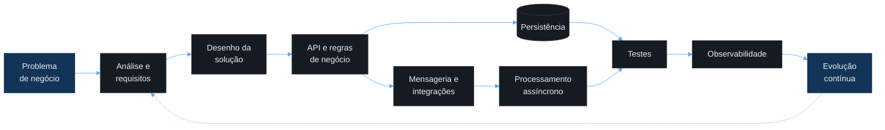
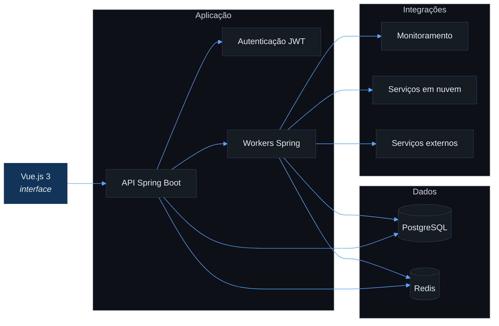

<!--
  GitHub Profile README
  Rafael Bueno — github.com/rafabue
-->

<div align="center">

<h1>R&nbsp;Λ&nbsp;F&nbsp;Λ&nbsp;E&nbsp;L</h1>


<p>
  Backend com Java e Spring · Sistemas que evoluem sem acumular complexidade
</p>

<p>
  <a href="https://linkedin.com/in/rafabue"></a>
  <a href="mailto:rafaelbuenodeveloper@gmail.com"></a>
  
</p>

</div>

---

## Sobre

Desenvolvedor backend com mais de 4 anos de experiência, focado em aplicações confiáveis, integrações entre sistemas e soluções que evoluem sem acumular complexidade desnecessária.

Atuo do levantamento de requisitos ao desenho, implementação, testes e entrega. Stack principal em **Java com Spring**, persistência em **PostgreSQL** e, quando o projeto pede visão full stack, interfaces em **Angular** e **Vue.js**.

Hoje sou **Analista de Desenvolvimento PL na Velsis (Curitiba)**, com foco em pesquisa e desenvolvimento, evolução de aplicações e arquitetura de software.

> Entender o problema antes de escolher a tecnologia — e preferir decisões reversíveis a arquiteturas "definitivas" desenhadas cedo demais.

---

## Como trabalho



---

## Stack

**Backend**


**Dados**


**Integração e mensageria**


**Testes**


**Infraestrutura**


**Frontend**


---

## Trajetória

| Período | Posição | Foco |
| :--- | :--- | :--- |
| **2021 – 2022** | Estágio em Engenharia de Software | Sistemas legados, relatórios e documentação técnica |
| **2023 – 2024** | Programador Backend JR | APIs REST, persistência e otimização de consultas SQL |
| **jan – ago 2025** | Programador Full Stack PL | Automação, dashboards e integração com plataformas de monitoramento |
| **set 2025 – hoje** | Analista de Desenvolvimento PL | Processamento concorrente, Spring Batch e integrações via Apache Kafka |

Passei por engenharia de sistemas legados, desenvolvimento backend e P&D — contato com diferentes camadas do ciclo de vida de software, de sistemas legados a plataformas internas em produção.

<details>
<summary><b>Atividades recorrentes</b></summary>

<br>

- Construção e manutenção de aplicações backend com Java e Spring
- Desenvolvimento de APIs e integrações entre sistemas
- Processamento assíncrono e mensageria
- Modelagem relacional e otimização de consultas PostgreSQL
- Testes de integração com ambientes containerizados
- Investigação de problemas de desempenho e confiabilidade
- Levantamento de requisitos com áreas técnicas e de negócio
- Ferramentas internas de automação e observabilidade

</details>

---

## Case técnico — Plataforma de automação e observabilidade

Concebi e conduzo a evolução de uma plataforma interna que centraliza informações operacionais, métricas, alertas e processos de automação.



**Desafios trabalhados:** processamento assíncrono em segundo plano, cache e controle de estado com Redis, integração com plataformas de monitoramento, coleta e consolidação de métricas, classificação automatizada de eventos, dashboards, georreferenciamento de ativos, execução containerizada, autenticação e controle de acesso, e redução de atividades operacionais manuais.

A solução recebeu reconhecimento interno na categoria de projetos inovadores. Por se tratar de produto corporativo, código-fonte, clientes, contratos e infraestrutura não são divulgados publicamente.

---

## Princípios

```java
public final class EngineeringPrinciples {

    private EngineeringPrinciples() {
    }

    public static final List<String> VALUES = List.of(
        "Compreender o problema antes de definir a solução",
        "Priorizar clareza antes de abstrações prematuras",
        "Automatizar processos repetitivos",
        "Tratar testes como parte do desenvolvimento",
        "Projetar sistemas considerando falhas",
        "Medir antes de otimizar",
        "Documentar decisões relevantes"
    );
}
```

---

## Formação

- **Pós-graduação em Arquitetura de Software** — Pontifícia Universidade Católica do Paraná *(em andamento)*
- **Tecnologia em Análise e Desenvolvimento de Sistemas** — Faculdade Censupeg *(concluído em 2026)*

---

## Atividade no GitHub

<p align="center">
  <a href="https://github.com/rafabue">
    
  </a>
</p>

<sub>O gráfico representa apenas a atividade pública no GitHub e não abrange repositórios privados ou corporativos.</sub>

---

<div align="center">

**Contato** · [LinkedIn](https://linkedin.com/in/rafabue) · [Email](mailto:rafaelbuenodeveloper@gmail.com)

</div>
